# Benchmarking Counterfactual Image Generation

###### Thomas Melistas

Thomas Melistas*, Nikos Spyrou*, Nefeli Gkouti*, Pedro Sanchez, Athanasios Vlontzos, Yannis Panagakis, Giorgos Papanastasiou, Sotirios A. Tsaftaris. "Benchmarking Counterfactual Image Generation." arxiv.org/abs/2403.20287 Under review. 2024

---

## Overview

- Background
  - What is Counterfactual Image Generation?
  - Methods and Models
- Evaluation Metrics
- Benchmarking Setup
- Results

---

## Counterfactual Image Generation

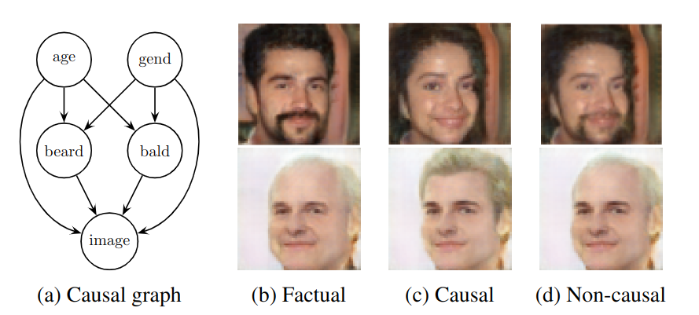

---

## Structural Causal Models

An SCM $\mathcal{G} := (\mathbf{S}, p (\boldsymbol{\epsilon}))$ consists of:

(i) structural assignments $\mathbf{S} = \{ f_i \}_{i=1}^N$, s.t. $x_i := f_i(\epsilon_i, \mathbf{pa}_i)$,
(ii) a joint distribution $p(\boldsymbol{\epsilon}) = \prod_{i=1}^Np(\epsilon_i)$ over mutually independent noise variables

$x_i$: an **endogenous** variable (observed)
$\mathbf{pa}_i$: the parents of $x_i$ (its direct *causes*, endogenous)
$\epsilon_i$: an **exogenous** variable (unobserved)

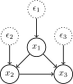

---

## Structural Causal Models

- Causal relations $\rightarrow$ directed acyclic graph (DAG)
- Acyclic $\rightarrow$ solve recursively for $x_i$ and obtain $\mathbf{x} = \mathbf{f}(\boldsymbol{\epsilon})$
- $\mathbf{x}$: a collection of observable variables, where $x_i$: image and $\mathbf{pa}_i$: image attributes

---

## Interventions and Counterfactuals

- *Interventional* distributions $P(x_j|do(x_i = y))$:
  - interventions: $x_i = f_i(\epsilon_i, \mathbf{pa}_i)$ $\rightarrow$ $x_i = y$
  - exogenous noise is sampled from the prior $P(\boldsymbol{\epsilon})$
- *Counterfactual* distributions $P(x_{j, x_i=y}|\mathbf{x})$:
  - interventions: as above
  - exogenous noise same with the observation $P(\boldsymbol{\epsilon} | \mathbf{x})$

---

## Interventions and Counterfactuals

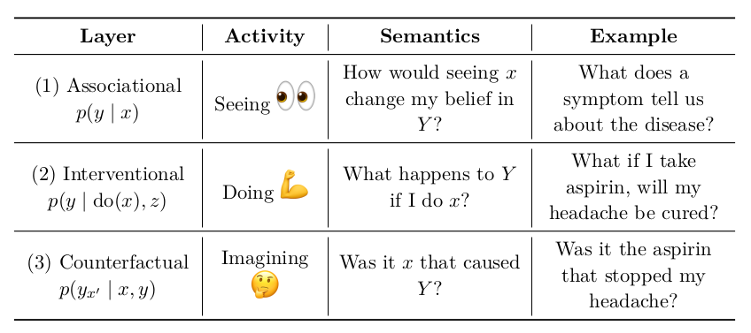

Pearl J. (2009). Causality

---

## Abduction-Action-Prediction

Counterfactuals using SCMs are computed in three steps:
(i) **Abduction**: Infer $P(\boldsymbol{\epsilon} | \mathbf{x})$, the state of the world (exogenous noise) that is compatible with the observation $\mathbf{x}$.
(ii) **Action**: Replace the structural equations $do(x_i = y)$, resulting in a modified SCM $\widetilde{\mathcal{G}} := \mathcal{G}_{\mathbf{x}; do(x_i = y)} = (\widetilde{\mathbf{S}}, P(\boldsymbol{\epsilon} | \mathbf{x}))$.
(iii) **Prediction**: Use the modified model to compute $P_{\widetilde{\mathcal{G}}}(\mathbf{x})$.

---

## Using Neural Networks for Abduction

<!-- We assume:
(i) Known causal graph (captured by a SCM)
(ii) No unobserved confounders (causal sufficiency) $\rightarrow$ $\epsilon_i$, $\epsilon_j$ mutually independent
(iii) Invertible causal mechanisms, $\epsilon_i = f_i^{-1}(x_i, \mathbf{pa}_i)$ $\forall$ $i \in [1,n]$ -->

Three categories of mechanisms:
(i) **Invertible, explicit**: Conditional Normalising Flows $\rightarrow$ attributes
(ii) **Amortised, explicit**: Conditional VAEs or Hierarchical VAEs $\rightarrow$ image
(iii) **Amortised, implicit**: Conditional GANs $\rightarrow$ image

Pawlowski et al. Deep structural causal models for tractable counterfactual inference. NeurIPS 2020

---

## Invertible, explicit

- Normalising flows perform mappings between probability densities
- A series of invertible transformations
- For an attribute $x_i$ we utilise a conditional NF $f(\epsilon_i;\mathbf{pa}_i)$ which is invertible: $\epsilon_i = f^{-1}(x_i;\mathbf{pa}_i)$

$$
    P(x_i | \mathbf{pa}_i ) = p(\epsilon_i) \left| \text{det} \, \nabla_{\epsilon_i} f(\epsilon_i;\mathbf{pa}_i) \right|^{-1}
$$

Trippe et al. Conditional density estimation with bayesian normalising
flows. 2018

---

## Amortised, explicit (with VAE)

- Encoder: $q_{\phi}(z|x, pa_{x})$ and Decoder: $p_{\theta}(x|z, pa_{x})$, trained with:
$$
     \text{ELBO}_{\beta}(\phi, \theta) = \mathbb{E}_{z \sim q_{\phi}(z|x, pa_{x})}[p_{\theta}(x|z, pa_{x})] - \beta D_{KL}[q_{\phi}(z|x, pa_{x}) || p(z)]
	\label{simplevaeloss}
$$

- The above likelihood and posterior are diagonal gaussians, whose $\mu$ and $\sigma$ we predict with neural networks
- Prior $p(z) \sim N(0,I)$.

Kingma & Welling. Auto-Encoding Variational Bayes. 2014

Higgins et al. Beta-vae: Learning basic visual concepts with a constrained variational framework. 2016

---

## Amortised, explicit (with VAE)

- Noise $\epsilon$ is decomposed into $z \sim q_{\phi}(z|x, pa_{x})$ and $u \sim N(0,I)$
- To perform counterfactual inference:
  - We sample the latent $z = \mu_{\phi}(x,pa_{x}) + \sigma_{\phi}(x, pa_{x}) * i$, $i \sim N(0,I)$
  - We sample the counterfactual $x^{*} = \mu_{\theta}(z,pa^{*}_{x}) + \sigma_{\theta}(z, pa^{*}_{x}) * u$,
  where $u = \frac{x - \mu_{\theta}(z,pa_{x})}{\sigma_{\theta}(z, pa_{x})}$

---

## Amortised, explicit (HVAE)

- We have $L$ layers of hierarchical latent variables $\boldsymbol{z}=\{z_1, z_2, ..., z_L\}$
- $h_{i} = h_{i+1} + f^{i}_{\omega}(z_{i}, pa_{x})$
$z_{i} \sim p_{\theta}(z_{i}|z_{>i}),$
$p_{\theta}(x|z_{1:L}, pa_x) = N(x|\mu_\theta(h_1), \sigma_\theta(h1))$
<!-- - $p_{\theta}(x , z_{1:L} | pa_x) = p_{\theta}(x|z_{1:L}, pa_x)p_{\theta}(z_{1:L})$ -->
- $q_{\phi}(z_{1:L}|x,pa_x) = q_{\phi}(z_{L}|x, pa_x)$
$q_{\phi}(z_{L-1}|z_{L},x, pa_x)...q_{\phi}(z_1|z_{i>1}, x, pa_x)$

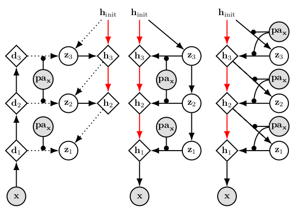

Sønderby et al, Ladder variational autoencoders. 2016

Ribeiro et al. High Fidelity Image Counterfactuals with Probabilistic Causal Models. 2023

---

## Amortised, implicit

- Encoder $E$: $z_x = E(x, pa_x)$
- Generator $G$: $x' =  G(z', pa_x)$, where $z' \sim N(0,I)$ or $z' = z_x$
- Discriminator $D(x', z', pa_x)$: generated $\rightarrow$ fake, data $\rightarrow$ real

$$
\min_{E,G}\max_{D}V(D, G, E) = \mathbb{E}_{q(x)p(pa_x)}[log(D(x, E(x, pa_x), pa_x))]
+ \mathbb{E}_{p(z)p(pa_x)}[log(1 - D(G(z, pa_x), z, pa_x))]
$$

Finetuning the encoder:
$$
L_x = \mathbb{E}_{x \sim q(x)}  \lVert x - G(E(x, pa_x),pa_x)\rVert_2
$$
$$
L_z = \mathbb{E}_{z \sim p(z)} \lVert z - E(G(z,pa_x), pa_x)\rVert
$$

To produce counterfactuals:
$$
x^* =  G(E(x, pa_x), pa^*_x))
$$

Dumoulin et al, Adversarially learned inference. 2017

Dash et al: Evaluating and mitigating bias in image classifiers: A causal perspective using counterfactuals. 2022

<!-- ---

## Metrics

Composition guarantees that the image and its attributes do not change without intervention. It
measures the ability of the mechanisms to reproduce the original image. Effectiveness determines
if the intervention was successful. Realism measures counterfactual image quality by capturing
similarity to the factual, while minimality evaluates whether the counterfactual only differs according
to the modified parent attribute against the factual, ideally leaving all other attributes unaffected.
For realism, we employ the FID metric, whilst for minimality, we use the Counterfactual Latent
Divergence metric proposed in  -->

---

## Metrics

We use 4 metrics to evaluate the generated counterfactuals
- **Composition**
- **Effectiveness**
- **Realism** (FID)
- **Minimality** (CLD)

---

## Composition

- Conceptually: the image and its attributes do not change without intervention
- *If we force a variable $X$ to a value $x$ it would have without the intervention, it should have no effect on the other variables*
- Therefore, a *null-intervention* applied $m$ times: $f^{m}_{\emptyset}$ should change no variable
- $\text{composition}^{m}(x,pa_x) = d(x, f^{m}_{\emptyset}(x, pa_x))$,
where $d(.,.)$ is a suitable distance metric

Galles & Pearl: An axiomatic characterization of causal counterfactuals. 1998

Monteiro et al. Measuring axiomatic soundness of counterfactual image models. 2022

---

## Effectiveness

- Conceptually: how successful was the performed intervention
- *If we force a variable $X$ to have the value $x$, then $X$ will take on the value $x$*
- We train an anti-causal predictor $g^{i}_{\theta}$ on observations, for each $pa^{i}_x$
- $\text{effectiveness}_{i}(x^{*}, pa^*{^i_x}) = d(g^{i}_{\theta}(x^{*}), pa^*{^i_x})$,
where $d(.,.)$: classification metric for categorical variables, regression for continuous

Galles & Pearl: An axiomatic characterization of causal counterfactuals. 1998

Monteiro et al. Measuring axiomatic soundness of counterfactual image models. 2022

---

## Fréchet Inception Distance (FID)

- Conceptually: Counterfactual image quality
- Measures the similarity of counterfactual images to observational data
- We use Inception-v3 trained on ImageNet to extract features
- Defined as:
$$
d^2((m_q, C_q),(m_p, C_p)) = ||m_q - m_p||_2^2 + \text{Tr}(C_q + C_p -2(C_q C_p)^\frac{1}{2})
$$

where $q$: counterfactual features distribution, $p$: factual features distribution Fréchet distance $d$ is defined as the distance between the Gaussian with mean $(m_q, C_q)$ obtained from $q$ and the Gaussian with mean $(m_p, C_p)$ obtained from $p$.

Heusel et al. Gans trained by a two time-scale update rule converge to a local nash equilibrium. 2017

---

## Counterfactual Latent Divergence (CLD)

- Conceptually: Counterfactual only differs in the intervened parent attribute
- Formally:
$$
\text{CLD} = \log ( w_1\exp{P(S_{x^*} \leq div)} + w_2\exp{P(S_{x} \geq div)} )
$$

,where: $div = d(x, x*)$, $S_x = \{d(x, x') | pa_{x'} = pa_x \}$, $S_{x^*} = \{d(x, x') | pa_{x'} = pa_{x^*} \}$

- $d(.,.)$: KL-divergence between the latents given by an unconditional VAE

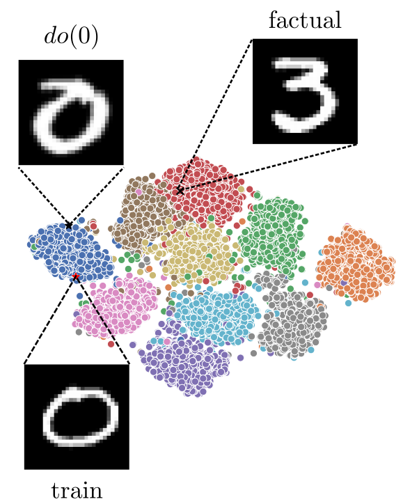

Sanchez & Tsaftaris: Diffusion Causal Models for Counterfactual Estimation. 2022

---

## Datasets used for benchmarking

- **MorphoMNIST**: Synthetic dataset of digits (32 $\times$ 32)
- **CelebA**: Human faces (64 $\times$ 64) $\rightarrow$ simple & complex causal graph
- **ADNI**: 2D slices of brain MRIs (192 $\times$ 192)

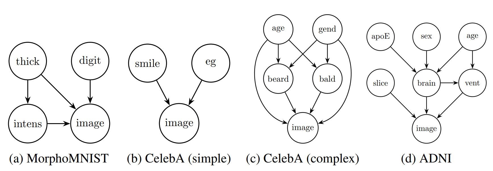

---

## Composition

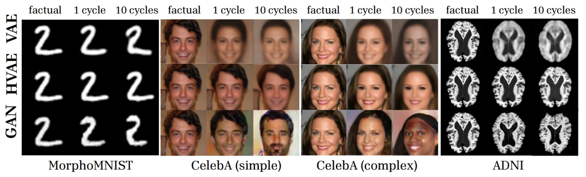

---

## Composition

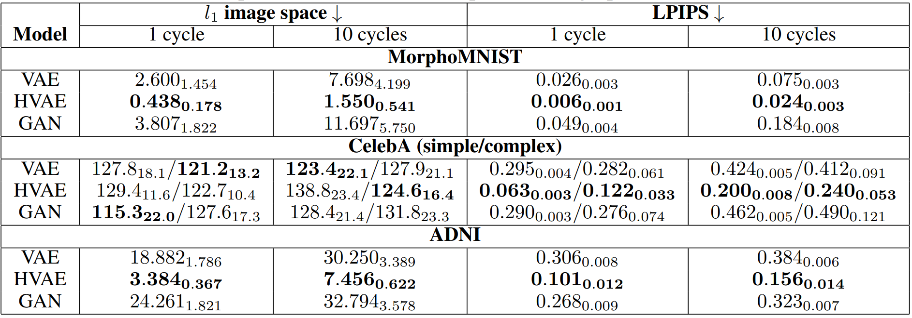

---

## Qualitative Results

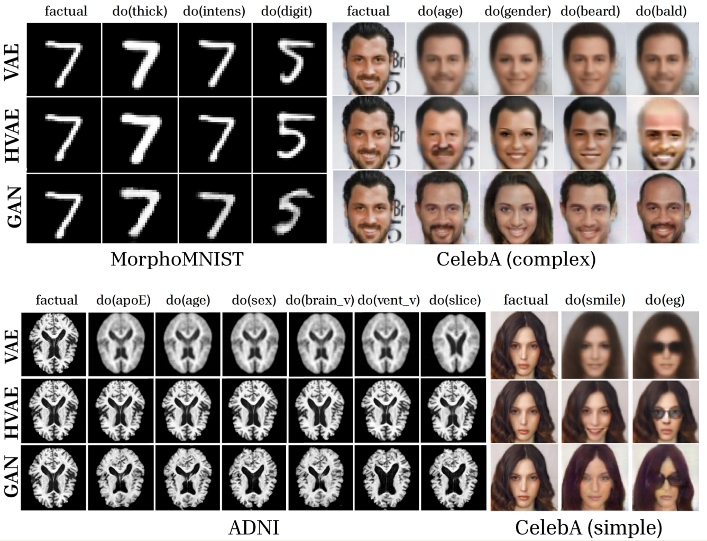

---

## Effectiveness

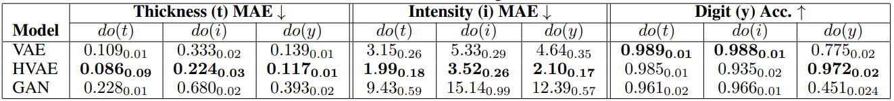
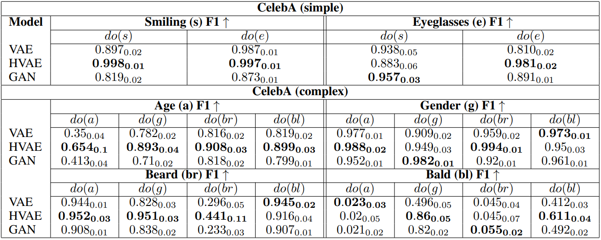
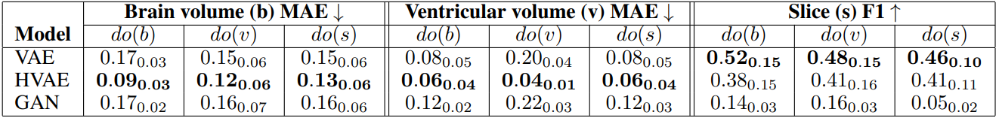

---

## Realism (FID) & Minimality (CLD)

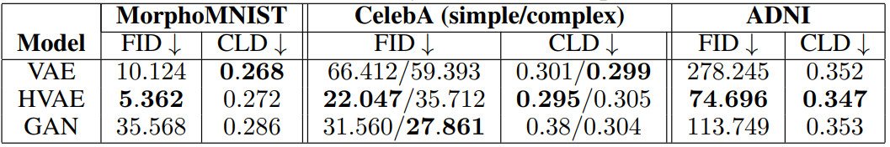

---

## Conclusions

- HVAE outperforms other models across metrics and datasets
- GAN counterfactuals more realistic than VAE but far from factuals for complex datasets
- Amortised implicit mechanisms $\rightarrow$ better abduction,
but hierarchical latents are important

---

## Future Work

- Extend to other
  - Generative models for the image mechanism (i.e. Diffusion Models)
  - Counterfactual paradigms (i.e. Deep Twin Networks, Backtracking Counterfactuals)
- Metrics
  - Limit bias of used model-dependent metrics (i.e. effectiveness, CLD)
  - Come up with new metrics

Sanchez & Tsaftaris: Diffusion Causal Models for Counterfactual Estimation. 2022

Vlontzos et al. Estimating categorical counterfactuals via deep twin networks. 2023
Kladny et al. Deep backtracking counterfactuals for causally compliant explanations. 2024

---

$Thank \quad you \quad for \quad your \quad attention!!!$
