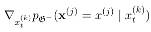
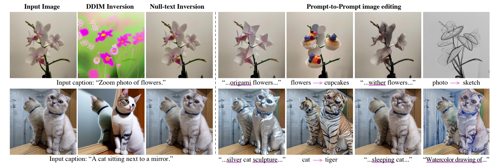

# Diffusion Causal Models for Counterfactual Estimation

###### Thomas Melistas

Sanchez, P., & Tsaftaris, S.A. (2022). Diffusion Causal Models for Counterfactual Estimation. CLEaR.

---

## Overview

- What are counterfactuals?
- Introduction to Structural Causal Models
- Unifying Diffusion and SCMs
- Related Work

---

## What are counterfactuals?

- Hypothetical scenarios

- Example: I got the vaccine and did not catch the flu, what is the probability I wouldn't catch the flu if I didn't get vaccinated?

- It cannot be computed straight away (I already got vaccinated)

 

Let's formalize this

---

## Graphs as Joint Distribution Factorizations

- Represent Bayesian Networks as DAGs
- Encode conditional independence (Markovian)

$p(a, v, f) = p(a) p(v | a) p(f | a, v)$

---

## Interventions

- Applying an action to a population $\rightarrow$ getting the vaccine

- We use the do-operator $do(V=v)$ or $do(v)$

- Different than conditioning: $p(f | do(v)) \neq p(f | v)$

$p(a, f | do(v)) = p(a) \cancelto{1}{p(v | a)} p(f | a, v) \neq p(a, f | v)$

 

---

## Counterfactuals

What is the probability that I (27 years old) wouldn't get the flu if I didn't get the vaccine?

$p(f| do(v'), f, a)$ ?

- Conflict: first $f$ is the hypothetical scenario and second $f$ is the observed one
- We denote the first by $f_{v'}$:
**Counterfactual** flu probability **under intervention** of no vaccination

$p(f| do(v'), a)$ : How probable is flu **if** we don't vaccinate people
$p(f_{v'}| v, f, a)$: How probable the flu **would be** if I hadn't vaccinated

---

## Pearl's Causal Hierarchy

<!-- -Pearl’s Causal Hierarchy or Pearl’s Ladder of Causation summarizes this -->

Pearl J. (2009). Causality

---

## Structural Causal Models

- Extension of Bayesian Networks
- Causal relationships $\rightarrow$ Deterministic, functional equations
- Stochasticity $\rightarrow$ Some variables remain unobserved

---

## Structural Causal Models

An SCM $\mathcal{M} := (\mathbf{S}, p (\boldsymbol{\epsilon}))$ consists of:

(i) structural assignments $\mathbf{S} = \{ f_i \}_{i=1}^N$, s.t. $x_i := f_i(\epsilon_i, \mathbf{pa}_i)$,
(ii) a joint distribution $p(\boldsymbol{\epsilon}) = \prod_{i=1}^Np(\epsilon_i)$ over mutually independent noise variables

$x_i$: an **endogenous** variable (observed)
$\mathbf{pa}_i$: the parents of $x_i$ (its direct *causes*, endogenous)
$\epsilon_i$: an **exogenous** variable (unobserved)

---

## Structural Causal Models

- In any SCM, each variable $x_i$ is caused by parent variables and unobserved exogenous **noise** variables $\epsilon_i$

---

## Counterfactual Inference with SCMs

In order to compute counterfactuals we need to:
1. Estimate the noise $\boldsymbol{\epsilon}$ given the observed datum $\mathbf{x}$ (factual)
We define $\mathcal{M}_x := (\mathbf{S}, p (\boldsymbol{\epsilon} | \mathbf{x}))$
2. To intervene on its structural assignments $\mathbf{S}$ with intervention $do(x_i = \widetilde{x_i})$
We define the modified, counterfactual SCM
$\widetilde{\mathcal{M}} := \mathcal{M}_{\mathbf{x}; do(\widetilde{x_i})} = (\widetilde{\mathbf{S}}, p(\boldsymbol{\epsilon} | \mathbf{x}))$

---

## Counterfactual Inference with SCMs

Three-step procedure:

1. **Abduction**: Infer $p(\boldsymbol{\epsilon} | \mathbf{x}))$, the state of the world (exogenous noise) that is compatible with the observations x.
2. **Action**: Replace the structural equations ($do(\widetilde{x_i})$) corresponding to the intervention, resulting in a modified SCM $\widetilde{\mathcal{M}} := \mathcal{M}_{\mathbf{x}; do(\widetilde{x_i})} = (\widetilde{\mathbf{S}}, p(\boldsymbol{\epsilon} | \mathbf{x}))$
3. **Prediction**: Use the modified model to compute $p_{\widetilde{\mathcal{M}}}(\mathbf{x})$

---

## Principle of Independent Mechanisms

$p(\mathbf{x}) =  \prod_{i=1}^Np(x_i | \mathbf{pa}_i)$

If we intervene on a subset $S$, then for all $i$:
1. If $i \notin S$, $p(x_i | \mathbf{pa}_i)$ remains unchanged
2. If $i \in S$, $p(x_i | \mathbf{pa}_i) = 1$, if $x_i$ the value set by the intervention, otherwise $0$

e.g. when intervening on $x_2$ the edges towards $x_2$ are removed

---

## What about images?

We can think of the image as a variable and its attributes as parents

Example of a possible graph and counterfactual estimation

Kladny K.R., et al. (2023). Deep Backtracking Counterfactuals for Causally Compliant Explanations

---

## Recap on DDPM
- $q(x_t \vert x_{t-1}) = \mathcal{N}(x_t; \sqrt{\alpha_t}x_{t-1}, (1-\alpha_t) I)$ (noising step)
- $p_{\theta}(x_T) = \mathcal{N}(x_T; 0, I).$
- $p_{\theta}(x_{t-1}|x_t) = \mathcal{N}(x_{t-1}; \mu_{\theta}(x_t,t), \sigma(x_t,t)^2 I)$ (denoising step)

$
\text{argmin}_{\theta} =
\frac
{(1-a_t)^2}
{\underbrace{2\sigma_q^2(t) (1-\bar{a}_t)a_t}_{\lambda_t}}
\left[
||e_0 - e_{\theta}(x_t,t)||_2^2
\right]
$

---

## Recap on Score-based models

$
\text{argmin}_{\theta} =
\frac
{(1-a_t)^2}
{2\sigma_q^2(t) a_t}
\left[
||s_\theta(x_t,t) - \nabla_{x_t} \log p(x_t)||_2^2
\right]
$

### and SDEs

$
dx=f(x,t)dt+g(t)dw
$

To sample from $x(T)\sim p_T$ and get new data from $p_{data}$, we can reverse the SDE:
$
dx = \left[ f(x,t) - g^2(t) \nabla_x \log p_t(x) \right] dt + g(t) d \tilde w.
$

With **(i)** the terminal distribution $p(T) \approx \pi (x)$ and **(ii)** the score $\nabla_x \log p_t(x)$, we train a *time dependent score model*, with objective:

$$
\mathbb{E}_{t \in U(0,T)}\mathbb{E}_{p_{t}(x)}[\lambda(t) \|\nabla_x \log p_t(x) - s_{\theta}(x, t)\|^2_2]
$$
---

---

## Teaser on DDIM and Classifier-Guidance

Song, J. et al. (2020). Denoising Diffusion Implicit Models

Dhariwal, P. et al. (2021). Diffusion Models Beat GANs on Image Synthesis

---

## Diff-SCM: Motivation

- SCMs have been previously used to provide a causal interpretation of SDEs for modeling time-dependent problems
- SDEs have been used to formalize diffusion process in a continuous manner
- Diff-SCM models the dynamics of causal variables as an Ito process $\mathbf{x}_t^{(k)}, \forall{t} \in [0, T]$, going from an observed endogenous variable  $\mathbf{x}_0^{(k)} = \mathbf{x}^{(k)}$ to its respective exogenous noise $\mathbf{x}_T^{(k)} = \mathbf{u}^{(k)}$ and back

Sokol, A. & Hansen N. (2014). Causal interpretation of stochastic differential equations

Bongers, S., & Mooij, J.M. (2018). From Random Differential Equations to Structural Causal Models: the stochastic case
Song, Y. et al. (2020). Score-Based Generative Modeling through Stochastic Differential Equations

---

## Diff-SCM: Unifying Diffusion Processes and Causal Models

- Forward diffusion $\rightarrow$ gradual weakening of the causal relations between variables of a SCM

- The original joint distribution $p_{\mathcal{G}}$ diffuses to independent Gaussians $p(U)$

---

## Diff-SCM: Unifying Diffusion Processes and Causal Models

- We can define a Deep SCM as a set of SDEs (1 for each node $k$):

  $d\mathbf{x}^{(k)} = - \frac{1}{2} \beta_t \mathbf{x}^{(k)} dt + \sqrt{\beta_t} d\mathbf{w}, \forall k \in [1, K]$,

where $p(\mathbf{x}_0^{(k)}) = \prod_{j=k}^Kp(\mathbf{x}^{(j)} | \mathbf{pa}^{(j)})$ and $p(\mathbf{x}_T^{(k)}) = p(\mathbf{u}^{(k)})$

- The reverse-time SDE of the above is given by:

  $d\mathbf{x}^{(k)} = \Big[ - \frac{1}{2} \beta_t + \beta_t \nabla_{\mathbf{x}_t^{(k)}} \log p(\mathbf{x}_t^{(k)})\Big] + \sqrt{(\beta_t)}\bar{\mathbf{w}}$

 To solve: Iteratively update $\mathbf{x}_T^{(k)} = \mathbf{u}^{(k)}$ with the gradient w.r.t. the input variable $\nabla_{\mathbf{x}_t^{(k)}} \log p(\mathbf{x}_t^{(k)})$ until it becomes $\mathbf{x}_0^{(k)} = \mathbf{x}^{(k)}$

---

## Apply Interventions with Anti-Causal Predictors

- We train an anti-causal classifier for each edge and a diffusion model for each node
- We use the gradients of the classifiers and diffusion models to propagate the intervention in the causal direction over the nodes

 

Schölkopf, B. et al. (2012). On Causal and Anticausal Learning

---

## Counterfactual Estimation with Diff-SCM

Three step procedure:
1. **Abduction**: Infer $p(\boldsymbol{u} | \mathbf{x}))$ $\rightarrow$  **Forward diffusion\***
2. **Action**: Modify SCM $\widetilde{\mathcal{M}} := \mathcal{M}_{\mathbf{x}; do(\widetilde{x_i})} = (\widetilde{\mathbf{S}}, p(\boldsymbol{u} | \mathbf{x}))$ $\rightarrow$ **Remove the edges between the intervened variable and its parents**
3. **Prediction**: Compute $p_{\widetilde{\mathcal{M}}}(\mathbf{x})$ $\rightarrow$ **Reverse diffusion\* controlled by the gradients of an anti-causal classifier**

*It actually follows the DDIM algorithm:

Song, J. et al. (2020). Denoising Diffusion Implicit Models

---

## Counterfactual Estimation with Diff-SCM

Formally: Estimate counterfactual $x_{CF}^{(k)}$ based on factual (observed) $x_{F}^{(k)}$ after $do(\mathbf{x}^{(j)} = x_{CF}^{(j)}), \mathbf{x}^{(j)} \in \mathbf{an}^{(k)}$

They do experiments for the simple case, two variables: $\mathbf{x}^{(j)} \rightarrow \mathbf{x}^{(k)}$

---

## Counterfactual Estimation with Diff-SCM

**Abduction of Exogenous Noise** By performing forward diffusion with an invertible process (e.g. DDIM, Neural ODEs) we get a latent $u^{(k)}$ that is invertible

**Prediction under Intervention** Counterfactual estimation: apply an intervention in the reverse diffusion process with the gradients of an anti-causal predictor
(*see classifier guidance of DDIM*)

---

---

## Controlling the Intervention

Three factors enable counterfactual estimation:
**(i)** The inferred $u^{(k)}$ keeps information of the factual observation
**(ii)** $\nabla_{\mathbf{x}_t^{(k)}} \log p_\phi(x_{CF}^{(j)} | x_t^{(k)})$ guides the intervention towards the desired counterfactual class
**(iii)** $\epsilon_\theta(x_t^{(k)}, t)$ forces the estimation to belong to the data distribution

 

A hyperparameter $s$ controls the scale of $\nabla_{\mathbf{x}_t^{(k)}} \log p_\phi(x_{CF}^{(j)} | x_t^{(k)})$

Dhariwal, P. et al. (2021). Diffusion Models Beat GANs on Image Synthesis

---

## Experimental Setup

Given an SCM $\mathcal{G}_{image}$ with two variables $\mathbf{x}^{(1)} \leftarrow \mathbf{x}^{(2)}$, $\quad$ $\mathbf{x}^{(1)}$: image, $\mathbf{x}^{(2)}$: class

- A diffusion model $\epsilon_\theta$ (U-Net) learns the score of the marginal distribution of $\mathbf{x}^{(1)}$

- An anticausal classifier $p_\phi(\mathbf{x}^{(2)} | \mathbf{x}^{(1)})$ (encoder of $\epsilon_\theta$ + pooling + linear layer)

Both conditioned on $t$ and trained separately

 

Trained and tested on MNIST and ImageNet

---

Schut, L. et al. (2021) Generating Interpretable Counterfactual Explanations By Implicit Minimisation of Epistemic and Aleatoric Uncertainties

Van Looveren, A et al. (2021). Interpretable Counterfactual Explanations Guided by Prototypes

---

## Counterfactual Latent Divergence (CLD)

- Used to evaluate minimality of intervention in latent space
- They train a VAE and measure KL divergence

---

## Use CLD to tune s

---

## Related work

- Counterfactual Explanations is a technique to test the robustness and bias of models by making minimal changes in order to change a classifier's prediction

Augustin, M. (2022). Diffusion Visual Counterfactual Explanations

---

## Related work

- Image-to-Image translation can be thought of as a case of counterfactual estimation

- Existing methods such as SDEdit or Null-text-Inversion deploy a very similar technique

Meng, Ch. et al. (2022). SDEdit: Guided Image Synthesis and Editing with Stochastic Differential Equations

---

Mokady, R et al. (2022). Null-text Inversion for Editing Real Images using Guided Diffusion Models

---
Thank you
for your time!

---

## Questions

- What are the difficulties in extending Diff-SCM to the general case?
- How can counterfactual properties such as minimality be evaluated?
- What can this framework offer, more than the classic image editing framework?
