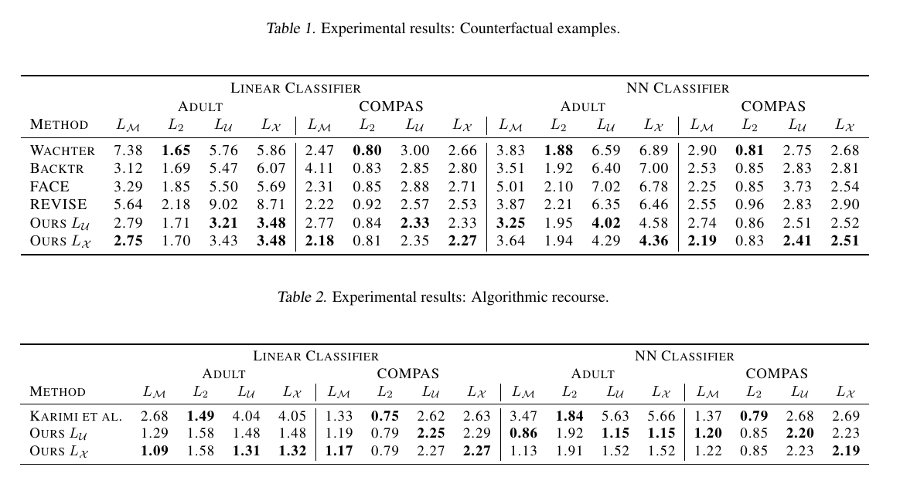

# On Data Manifolds Entailed by Structural Causal Models

###### Thomas Melistas

Dominguez-Olmedo, et al. "On Data Manifolds Entailed by Structural Causal Models." ICML, 2023

---

## Overview

- Data Manifolds & Riemannian metric
- A Recap on Structural Causal Models (SCMs)
- Riemannian Manifolds for SCMs
- Application to Counterfactual Explanations

---

## Data Manifolds

- <u>Manifold Hypothesis</u>: *Many high-dimensional real world datasets lie along low-dimensional latent manifolds inside that high-dimensional space*
- The geometric structure of the data manifold is a powerful inductive bias
- Under smoothness conditions, generative models entail data manifolds in which we can use differential geometry & exploit geometric structure for distances, interpolations, etc.

---

### Motivating the use of Riemannian metric (through a VAE case study)

- Points **A** and **B** are in fact closer to each other than **C**, we just measure distance incorrectly!

Arvanitidis, et al. "Latent Space Oddity: On The Curvature Of Deep Generative Models." ICLR, 2018

---

### Motivating the use of Riemannian metric (through a VAE case study)

- $\mathbf{x} \in \mathcal{X}, \mathbf{z} \in \mathcal{Z},$ sufficiently smooth generator $f: \mathcal{Z} \rightarrow \mathcal{X}: \mathbf{x}=f(\mathbf{z})$

- We consider a smooth latent curve: $\gamma_t : [0, 1] \rightarrow \mathcal{Z}$ and we map it to $\mathcal{X}$ through $f$ to measure lengths in input space

- We can find shortest path by solving ODEs that use the Riemannian metric $\mathbf{M_\gamma} = \mathbf{J_\gamma^T J_\gamma}$, where $\mathbf{J_\gamma} = \frac{\partial f} {\partial \mathbf{z}}\Bigr|_{\substack{\mathbf{z} = \gamma}}$

Arvanitidis, et al. "Latent Space Oddity: On The Curvature Of Deep Generative Models." ICLR, 2018

---

### Motivating the use of Riemannian metric (through a VAE case study)

- The smoothness assumptions for VAEs involve:
  - twice differentiable activation functions
  - large data dimension (to apply the previous to stochastic generator)
- They use the Riemannian metric for (i) k-means, (ii) interpolations, (iii) different latent probability distribution, (iv) Riemannian random walks

Arvanitidis, et al. "Latent Space Oddity: On The Curvature Of Deep Generative Models." ICLR, 2018

---

## What is a Riemannian manifold?

- A d-dimensional smooth manifold $\mathcal{M}$ equipped with a Riemannian metric $\mathbf{M} : \mathcal{M} \rightarrow \mathcal{S}^d_{++},\qquad$ with $\mathcal{S}^d_{++}$ being a symmetric positive definite matrix

- The length of a smooth curve $\gamma_t : [0, 1] \rightarrow \mathcal{M}$ is:
$$
L(\gamma) = \int_0^1 \sqrt{\dot{\gamma}(t)^T \mathbf{M}(\gamma(t)) \dot{\gamma}(t)} dt, \qquad \qquad \dot{\gamma}(t) = \frac{d}{dt}\gamma(t)
$$

- The Riemannian distance betweeen $p, q \in \mathcal{M}$ is:
$$d_\mathbf{M}(p, q) = \text{inf}\{L(\gamma) | \gamma(0) = p, \gamma(1) = q\}$$

- Riemannian volume measure: magnitude of local distortion at $p \in \mathcal{M}$:
$$\text{Vol}_\mathbf{M}(p) := \sqrt{\text{det}\mathbf{M}(p)} $$

---

## Pullback metric

- It is used when we do not have a metric for a space
- For a smooth mapping between manifolds $\phi: \mathcal{W} \rightarrow \mathcal{M}$, we can define a Riemannian metric for $\mathcal{W}$ as:
$$\mathbf{W}(w) := \mathbf{J}\phi(w)^T \mathbf{M}(\phi(w)) \mathbf{J}\phi(w),$$
where $\mathbf{J}\phi(w)$ is the jacobian of $\phi$ at $w \in \mathcal{W}$
- if $\phi$ is a diffeomorphism (immersion + injective):
$$d_\mathbf{W}(p, q) = d_\mathbf{M}(\phi(p), \phi(q))$$

---

## Structural Causal Models

- An SCM $\mathcal{M} := (\mathbf{S}, P_\mathbf{U})$ consists of:

(i) structural assignments $\mathbf{S} = \{ f_i \}_{i=1}^d$, s.t. $X_i := f_i(\mathbf{X}_{pa(i)}, U_i)$,
(ii) a joint distribution $P_\mathbf{U}(U_1, ..., U_d) = \prod_{i=1}^d P(U_i)$ over mutually independent noise variables

$X_i$: an **endogenous** variable (observed)
$\mathbf{X}_{pa(i)}$: the parents of $X_i$ (its direct *causes*, endogenous)
$U_i$: an **exogenous** variable (unobserved)

---

## Structural Causal Models

- $X_i$ is caused by parent variables $\mathbf{X}_{pa(i)}$ and exogenous noise variables $U_i$
- Since the causal graph is acyclic we can substitute parents recursively and obtain $x = f(u)$ (reduced form mapping)
- The entailed observational distribution is $P_\mathbf{X}(\mathbf{X} = x) := P_\mathbf{U}(\mathbf{U} = f^{-1}(x))$

---

### Interventional distributions

- Hard interventions $\mathcal{J} := do(\mathbf{X}_\mathcal{I} = \theta)$ fix a subset of endogenous variables $\mathcal{I}$ to $\theta \in \mathbb{R}^{|\mathcal{I}|}$, s.t. $\mathbf{S}^\mathcal{J} = \theta_i$ for intervened variables
- This entails the interventional distribution $P_\mathbf{X}^\mathcal{J}$

---

### Counterfactual distributions

- Counterfactuals refer to the efect of a hypothetical intervention $\mathcal{J}$ to an observation $x$
- To compute the counterfactual, we change the structural assignments $\mathbf{S}^\mathcal{J}$ as before, but instead of sampling from $P_\mathbf{U}$, we compute the posterior $P_{\mathbf{U}|x}$
- this colapses to a single realization $u = f^{-1}(x)$ and counterfactual $x^{CF}$
(f is invertible)
- To define a distribution, we consider a space of interventions $\mathcal{H} := \{do(\mathbf{X}_\mathcal{I} = \theta) | \theta \in \Delta \}, \qquad$ $\Delta$ being the possible interventions

---

## SCMs Entail Smooth Manifolds

- Sufficient conditions for the SCMs to induce observational, interventional and counterfactual smooth manifolds
- All are true for three popular classes of SCMs (restrictred functional classes on $\mathbf{S}$):
  - **Additive noise models** (ANMs): $\mathbf{S} := f_i(\mathbf{X}_{pa(i)}) + U_i$
  - **Post-nonlinear models**: $\mathbf{S} := g_i(f_i(\mathbf{X}_{pa(i)}) + U_i), \quad$ $g_i$ invertible
  - **Location-scale noise models**: $\mathbf{S} := f_i(\mathbf{X}_{pa(i)}) + g_i(\mathbf{X}_{pa(i)})U_i, \quad$
  $g_i$ strictly positive

---

### Exogenous space smoothness

- The exogenous space $\mathcal{U}$ is a $d$-dimensional smooth manifold, *if the support of every $P_{U_i}$ is a $d_i$-dimensional smooth manifold*, where $d = \sum_id_i$
- Typical choices for $P_{U_i}$ include Gaussian, Gamma distributions, etc. whose support is an open interval of $\mathbb{R}$, a 1-dimensional smooth manifold

---

### Endogenous space smoothness

- As we showed before, for acyclic SCMs: $\mathcal{X} = f(\mathcal{U})$, we further want:
  - $f_i$ differentiable, $\partial_{U_i}f_i(X_{pa_i}, U_i)$ non vanishing (immersion)
  - $f_i(X_{pa_i}, u_i^{(1)}) \neq f_i(X_{pa_i}, u_i^{(2)})$ $\forall  u_i^{(1)} \neq u_i^{(2)}$ (injective)
- Interventions entail $(d-m)$-dimensional smooth manifolds ($m = |\mathcal{I}|$), without additional constraints
- The counterfactual space $\mathcal{X}^{\mathcal{H}|x}$ is a $m$-dimensional smooth manifold, without additional constraints
  - only causal descendants of intervened variables need to have differentiable $f_i$
  - no constraints on $\mathbf{U}$

---

## SCMs Entail (Riemannian) Data Manifolds

- In previous VAE example, a locally Euclidian metric is regularized to have large volume measure on sparse feature space $\rightarrow$ Curves crossing low data density regions will have large length
- $\mathcal{U}$ isometric to $\mathcal{X}$ if previous constraints exist
- For any Riemannian metric $\mathbf{M}_\mathcal{U}$ exists a pullback $\mathbf{M}_\mathcal{X}$ and vice-versa for mapping $f$

---

### Locally Euclidian in $\mathcal{X}$

- Inductive bias: The exogenous noise $\mathbf{U}$ should be similar if it leads to similar observations (in a locally euclidian sense)
- Intuitively, places more weight in differences in outcomes
- Good choice when noise merely represents stochasticity
- The pullback metric $\mathbf{M}_\mathcal{U}$ defines a metric in the exogenous space $\mathcal{U}$ grounded on the observed space $\mathcal{X}$

---

### Locally Euclidian in $\mathcal{U}$

- Inductive bias: The observables $\mathbf{X}$ should be similar if they were produced from similar noise (in a locally euclidian sense)
- Intuitively, places more weight in differences in causes
- To be a meaningful metric, noise must be meaningful itself (e.g. deviation from a trend in ANMs)

---

### Regularizing the Riemannian metric

- We want: large volume measure $\text{Vol}_\mathbf{M}(p)$ (magnitude of local distortion at $p$) in regions with low data density
- The Riemannian metric is scaled as:
$$\text{Vol}_{\lambda_{\mathbf{X}}\mathbf{M}}(x) = \frac{\text{Vol}_{\mathbf{M}}(x)}{\alpha \cdot p_{\mathbf{X}}(x) + \beta},$$
where $\alpha$, $\beta$ hyperparameters that determine the local curvature as a function of data density $p_{\mathbf{X}}$
- For the interventional manifold we scale by the density of the interventional $P_\mathbf{X}^\mathcal{J}$
- For the counterfactual we scale by the observational $p_{\mathbf{X}}$ $\rightarrow$ assumes "realistic" counterfactuals

Arvanitidis, et al. "A prior-based approximate latent Riemannian metric." AISTATS, 2022

---

## Counterfactual Explanations

- Not counterfactuals in the causal sense
- Assume a classifier $h: \mathcal{X} \rightarrow {0, 1}$
- For a $x$, s.t. $h(x) = 0$, search for the closest positively classified $x'$:
$$\underset{x' \in \mathcal{X}}{\text{arg} \text{min}} \quad d(x, x'), \qquad h(x') = 1$$
- The distance function $d$ encodes desired similarity

---

### Desiderata for counterfactual explanations

- Realistic (supported by observed data):
  - Plausible path of change $x \rightarrow x'$ (important for Algorithmic Recourse [1])
  - We use Riemannian distance for $d$ $\rightarrow$ there exists a *shortest curve*
- Causally grounded:
  - Prior works (i) search for interventions [2] or (ii) use backtracking counterfactuals [3]
  but do not consider data manifold

[1] Poyiadzi, et al. "Feasible and actionable counterfactual explanations." AI, Ethics, Society 2020

[2] Karimi et al. "Algorithmic recourse: from counterfactual explanations to interventions" 2021.
[3] von Kügelgen et al. "Backtracking counterfactuals", CLeaR 2023.

---

### Backtracking on the data manifold

- The structural assignments $\mathbf{S}$ do not change (no interventions), but the exogenous noise variables $\mathbf{U'}$ are modified (conditioned to the initial $\mathbf{U}$)
$$\underset{u \in \mathcal{U}}{\text{min}} \quad d(f^{-1}(x), u), \quad \text{s.t.} \quad h(f(u)) = 1$$
- We search along the exogenous space $\mathcal{U}$, using the scaled (with $p_\mathbf{U}$) Riemannian distance $d_{\lambda_U\mathbf{M}}$ as $d$ to optimize
- Without loss of generality we can use the pullback metric from $\mathcal{X}$

---

### Causal Algorithmic Recourse on the data manifold

- Interventions are recommended, the following must be optimized:
$$\underset{\mathcal{J} \in \mathcal{H}}{\text{min}} \quad d(x, \mathbb{CF}(x, \mathcal{J})), \quad \text{s.t.} \quad h(\mathbb{CF}(x, \mathcal{J})) = 1,$$
where $\mathbb{CF}$ maps factuals to counterfactuals under $\mathcal{J}$ interventions on $\mathbf{X}_\mathcal{I}$, and $d(x, \mathbb{CF}(x, do(\mathbf{X}_\mathcal{I} = \theta))) = \|x_\mathcal{I} - \theta \|$
- We search on counterfactual manifold $\mathcal{X}^{\mathcal{H}|x}$, scaling the Riemannian metric $\mathbf{M}$ (with the observational $p_\mathbf{X}$) and taking the pullback $\mathbf{M'}$ via the counterfactual mapping $\mathbb{CF}$
- We use $d_{\mathbf{M'}}$ as $d$ and optimize

---

### How to optimize along the manifold

- Compute Riemannian distances by solving for the geodesic $\gamma^*$: $\gamma(0) = u_0, \gamma(1) = u_1$, s.t. $d_{\mathbf{M}}(u_0, u_1) := \mathcal{L}(\gamma^*)$
- We can compute $\gamma^*$ by solving the ODEs (binary value problem)

---

## Experiments

- Datasets (tabular): COMPAS recidivism, Adult demographic
- Models for assignments: Additive Noise Models (using MLPs with 1 hidden layer)
- Modeling probability density of $\mathbf{U}$ with kernel density estimation
- Linear classifiers & NN classifiers (2 hidden layers)

---

### Baselines

- Wachter [1]: objective function $\text{min}_\delta\lambda\| \delta \|_2 + l(h(x+\delta), 1)$
$l$ cross-entropy loss, gradually anneald $\lambda$
- REVISE [2]: above, but optimization in the latent space of a VAE
- FACE [3]: search on a weighted nearest-neighbor graph
- Karimi [4]: (see algorithmic recourse in previous slide)
- Backtracking [5]: (see backtracking counterfactuals in previous slide)
euclidian distances in $\mathcal{U}$

[1] Wachter, et al. "Counterfactual explanations without opening the black box: Automated decisions and the gdpr." 2017

[2] Joshi, et al. Towards realistic individual recourse and actionable explanations in black-box decision making systems. 2019.
[3] Poyiadzi, et al. "Feasible and actionable counterfactual explanations." AI, Ethics, Society 2020
[4] Karimi et al. "Algorithmic recourse: from counterfactual explanations to interventions" 2021.
[5] von Kügelgen et al. "Backtracking counterfactuals", CLeaR 2023.

---

### Evaluation metrics
- $L_2$: $l_2$ distance between factual and counterfactual
- $L_{\mathcal{U}}$, $L_{\mathcal{X}}$: Riemannian distance where metric is locally Euclidian in $\mathcal{U}$ and scaled by $\lambda_{\mathbf{U}}$ (and $\mathcal{X}$ by $\lambda_{\mathbf{X}}$ respectively)
- $L_{\mathcal{M}}$: Riemannian distance induced by a data manifold constructed using kernel density estimation, with a locally Euclidean metric in feature space

---

---

### Results

- Closer in $L_{\mathcal{U}}$, $L_{\mathcal{X}}$ as expected
- $L_{\mathcal{M}}$ shows that they generalize despite functional assumptions (ANMs)

---

$\mathcal{Thank}$ $\mathcal{you}$ $\mathcal{for}$ $\mathcal{your}$ $\mathcal{attention}$

---

## Questions

- Would this work with deep mechanisms (i.e. VAE, GAN, Diffusion)
for high-dimensional variables (i.e. images)?
